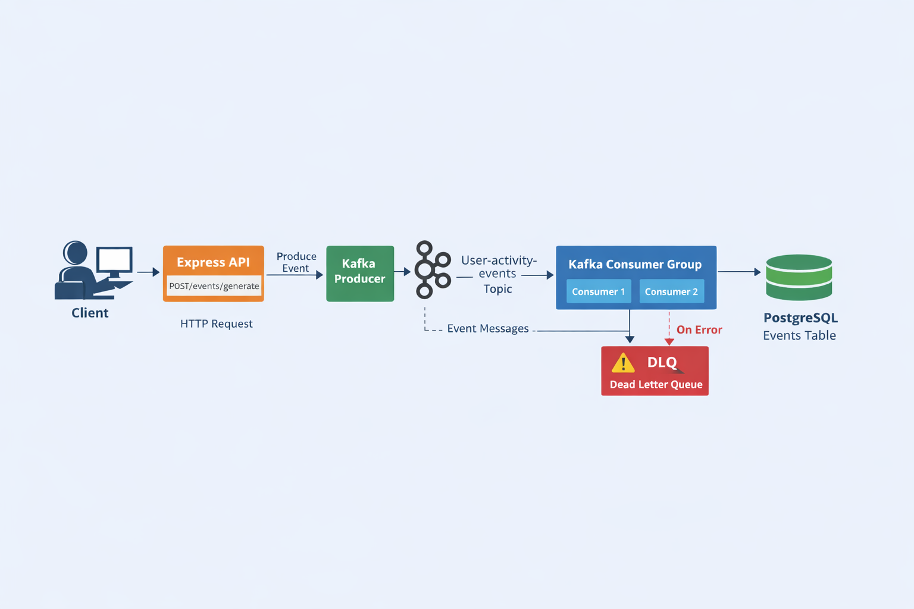

# Kafka Event Microservice

A production-ready event-driven microservice built using **Node.js, Apache Kafka, and PostgreSQL**.

This service:

- Publishes user activity events to Kafka
- Consumes events using a Kafka consumer group
- Ensures idempotent event processing
- Persists events into PostgreSQL
- Implements a Dead Letter Queue (DLQ)
- Supports graceful shutdown
- Is fully containerized using Docker
- Includes unit and integration tests

This project demonstrates real-world backend engineering practices for event-driven architectures.

---
#  Architecture Overview

This project follows an **event-driven microservice architecture** using Apache Kafka.
##  Architecture Diagram

The following diagram illustrates the event-driven architecture of the system:



---
##  Event Flow

1. Client sends HTTP request to `POST /events/generate`
2. Express API publishes a `UserEvent` to Kafka topic `user-activity-events`
3. Kafka Consumer (member of `user-activity-consumer-group`) consumes the event
4. Consumer stores the event in PostgreSQL
5. If processing fails, the event is sent to the Dead Letter Queue topic `user-activity-events-dlq`

---

##  System Components

- **Express API** – REST endpoints
- **Kafka Producer** – Publishes events
- **Kafka Topic** – `user-activity-events`
- **Kafka Consumer Group** – `user-activity-consumer-group`
- **PostgreSQL Database** – Stores processed events
- **Dead Letter Queue (DLQ)** – `user-activity-events-dlq`
----
#  Tech Stack

- Node.js (Express)
- Apache Kafka (KafkaJS)
- PostgreSQL
- Docker & Docker Compose
- Jest (Unit Testing)
- Supertest (API Testing)
-----
# Features Implemented

##  Event Publishing

- Endpoint: `POST /events/generate`
- Publishes event to Kafka topic `user-activity-events`
- Generates UUID-based `eventId`
- Includes ISO timestamp
- Accepts structured JSON payload
---
### UserEvent Structure

```json
{
  "eventId": "uuid",
  "userId": "string",
  "eventType": "LOGIN | LOGOUT | PRODUCT_VIEW",
  "timestamp": "ISO string",
  "payload": {}
}
```

---

##  Kafka Consumer Group

- Subscribes to topic `user-activity-events`
- Member of `user-activity-consumer-group`
- Processes events continuously
- Logs `eventId`, `userId`, and `eventType`

---

##  Idempotency

Duplicate events are handled safely using:

```sql
ON CONFLICT (id) DO NOTHING
```

This guarantees that events with the same `eventId` are processed only once.

---

##  Dead Letter Queue (DLQ)

If event processing fails (e.g., DB error, malformed message):

- Event is published to:
  `user-activity-events-dlq`

This ensures fault isolation and production readiness.

---

##  PostgreSQL Persistence

- Events are stored in the `events` table
- Containerized PostgreSQL
- Automatic table initialization
- JSON payload support

---

##  Graceful Shutdown

Handles:

- `SIGINT`
- `SIGTERM`

Safely disconnects:

- Kafka Producer
- Kafka Consumer
- PostgreSQL connection
- HTTP server

---

##  Health Check Endpoint

```
GET /health
```

Response:

```json
{
  "status": "UP"
}
```
#  Database Schema

```sql
CREATE TABLE IF NOT EXISTS events (
  id UUID PRIMARY KEY,
  user_id TEXT NOT NULL,
  event_type TEXT NOT NULL,
  payload JSONB,
  created_at TIMESTAMP DEFAULT CURRENT_TIMESTAMP
);
```
#  API Endpoints

## 1️ Generate Event

POST `/events/generate`

### Request Body

```json
{
  "userId": "user123",
  "eventType": "LOGIN",
  "payload": {
    "example": "data"
  }
}
```

### Response

```json
{
  "message": "Event published successfully",
  "eventId": "uuid-value"
}
```

---

## 2️ View Processed Events

GET `/events/processed`

Returns:

```json
[
  {
    "id": "uuid",
    "user_id": "user123",
    "event_type": "LOGIN",
    "payload": {},
    "created_at": "timestamp"
  }
]
```

---

## 3️ Health Check

GET `/health`

---
#  Docker Setup

## Run Application

```bash
docker-compose up --build
```

Services included:

- Zookeeper
- Kafka
- PostgreSQL
- App Service

All services include:

- Health checks
- Dependency management
- Restart policies
----
#  Environment Variables

All configurations are managed via environment variables:

```
PORT=3000
KAFKA_BROKER=kafka:9092
KAFKA_TOPIC=user-activity-events
KAFKA_CONSUMER_GROUP=user-activity-consumer-group
KAFKA_DLQ_TOPIC=user-activity-events-dlq

DB_HOST=postgres
DB_USER=postgres
DB_PASSWORD=postgres
DB_NAME=eventsdb
DB_PORT=5432
```
---
# Testing

Run all tests:

```bash
npm test
```

Test Coverage Includes:

-  Producer unit tests
-  Consumer idempotency tests
-  API integration tests

Expected Output:

```
PASS tests/producer.test.js
PASS tests/consumer.test.js
PASS tests/app.test.js
```
----
#  Future Improvements

- Request validation (Joi / Zod)
- Structured logging (Winston / Pino)
- Prometheus metrics
- CI/CD integration
- Multi-broker Kafka cluster
- Authentication & authorization
